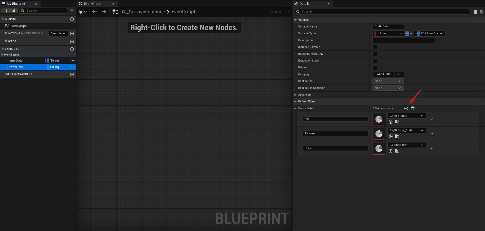

# 🚀 How to create a crafting recipe ?

### 1. Create a new crafting data asset

Go to the **Content Browser**, right-click → **Miscellaneous → Data Asset**.

Select `BP_ItemCraftData` as the class, then name it something like `DA_Wood_Craft`.

---

### 2. Fill in the crafting recipe informations

Open the newly created Data Asset and fill in the fields:

| Property         | Description                                                     |
|------------------|-----------------------------------------------------------------|
| `Item Output`    | Reference to the resulting item (`PDA_ItemData`)                |
| `Output Amount`  | Number of items crafted per recipe                              |
| `Craft Costs`    | Array of required items and their amounts                        |
| `Time to Craft`  | Time (in seconds) needed to craft the item                      |
| `Crafted Sound`  | Sound when craft finished                      |
| `Crafting Sound`  | Sound when crafting is in progress                      |

### 2. Add the recipe in the game data

Open : `MPSurvival/Blueprints/PlayerCharacter/GI_SurvivalInstance`

Then add the crafting recipe asset in the map variable called : `CraftsData`

