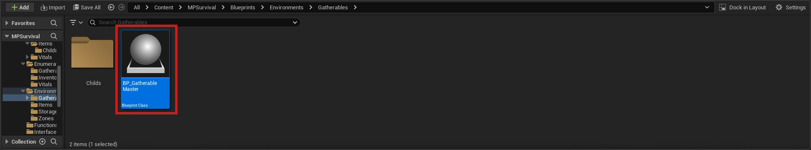

# 🚀 How to create a gatherable ?

### 1. Create a new gatherable data asset

Go to the **Content Browser**, right-click → **Miscellaneous → Data Asset**.

Select `BP_GatherableData` as the class, then name it something like `DA_Tree_Gatherable`.

---

### 2. Fill in the gatherable informations

Open the newly created Data Asset and fill in the fields:

| Property           | Description                                                            |
|--------------------|------------------------------------------------------------------------|
| `Gatherable Type`  | Enum value from `E_GatherableTypes` (e.g. Tree, Stone, Bush...)        |
| `Gatherable Health`| Amount of damage the gatherable can take before being destroyed        |
| `Drop Loots`       | Array of items dropped when the gatherable is destroyed                |
| `Gatherable Mesh`  | Static mesh representing the gatherable object                         |
| `Destroy Sound`    | Sound played when the gatherable is destroyed                          |

!!! tip  
    You can extend the `E_GatherableTypes` enum to add custom gatherable categories.

---

### 3. Place it in the world

You can create a child of this blueprint and set the PDA_GatherableData in his default settings

---