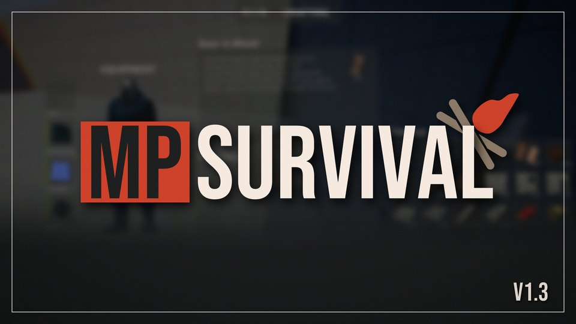
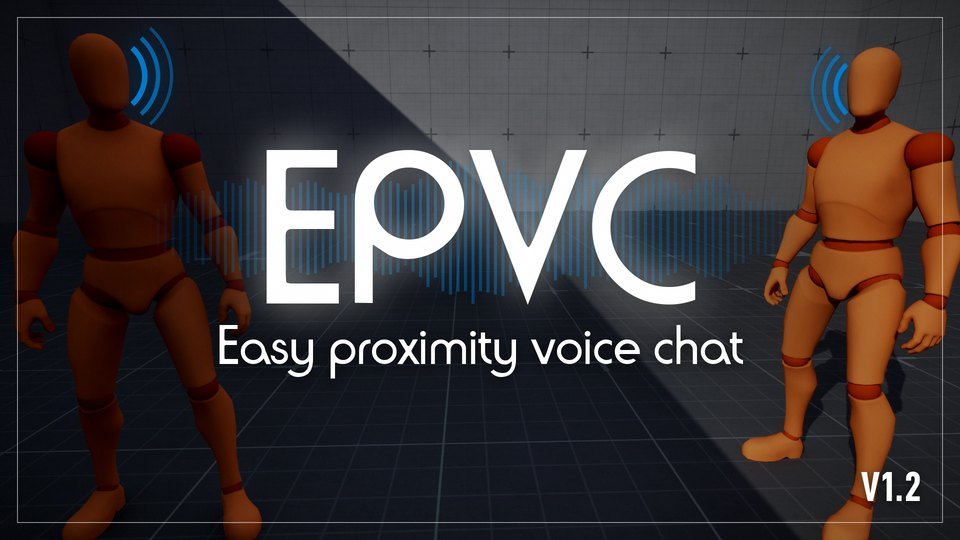
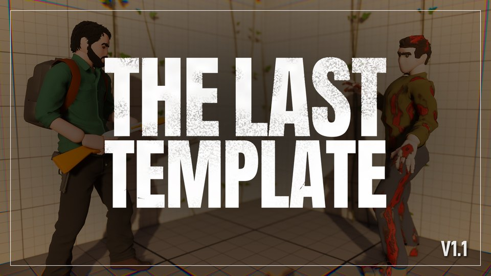
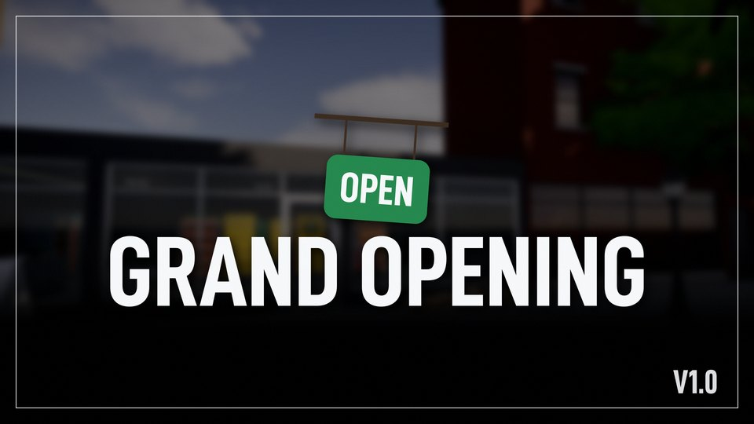
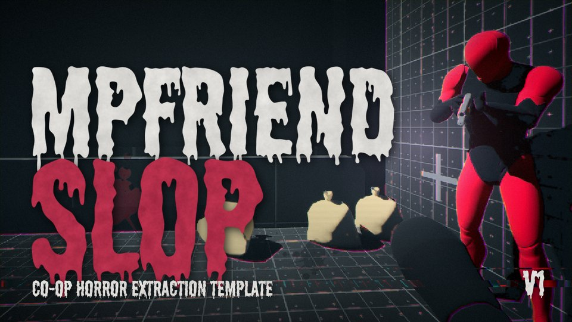

---
hide:
  - navigation
---

# Del Studio Assets Documentation

Manuals for the Unreal Engine templates and plugins made by Del Studio. Each asset has its own tab at the top and its own pages, so nothing gets mixed up.

Template

### [MPSurvival](mpsurvival/index.md)

The ultimate multiplayer survival template, with inventory, crafting, vitals, gathering, equipment, storage and more. 100% Blueprint-based and fully networked.

Plugin

### [Easy Proximity Voice Chat](epvc/index.md)

Drop-in proximity voice chat over normal replication, no OnlineSubsystem, no EOS/Steam voice setup. Channels, radios & intercoms, voice effects, occlusion through geometry, runtime-swappable config, server & client muting, and Blueprint events. Dedicated-server ready and PIE-testable.

Template

### [The Last Template](tlt/index.md)

A third person survival action template. Locomotion and traversal, guns and melee, inventory and crafting, enemies that see and hear you, a full menu and save system, photo mode and a showcase map. 100% Blueprint, and almost every change is a Data Asset instead of a graph.

Template

### [Grand Opening](go/index.md)

A first person store management template. Order stock from the office computer, carry the boxes in, fill the shelves, serve customers at the till and count their change by hand. Employees, deliveries, a wholesale market, ad campaigns, build mode and multi-slot saving. 100% Blueprint, and the low poly mesh kit is included.

Template

### [MPFriendslopV2](mpfriendslopv2/index.md)

A first person co-op extraction horror template. Loot a dark map with your crew, carry every item with physics, sell it at the extraction trap to meet the quota, and jump into the shaft to get out. A patrolling enemy that hears you, a revive bay for lost heads, a shop terminal, a gun and melee, cosmetics, emotes, pings, and sessions with a lobby. 100% Blueprint on a listen server, and almost every change is a Data Asset instead of a graph.

<!-- Add new assets here as they are released. Duplicate one ds-entry block above and point it to the new asset's index page. -->

## Help

Questions, bug reports and ideas go on the [Discord server](https://discord.gg/EqHCtq38jy).
