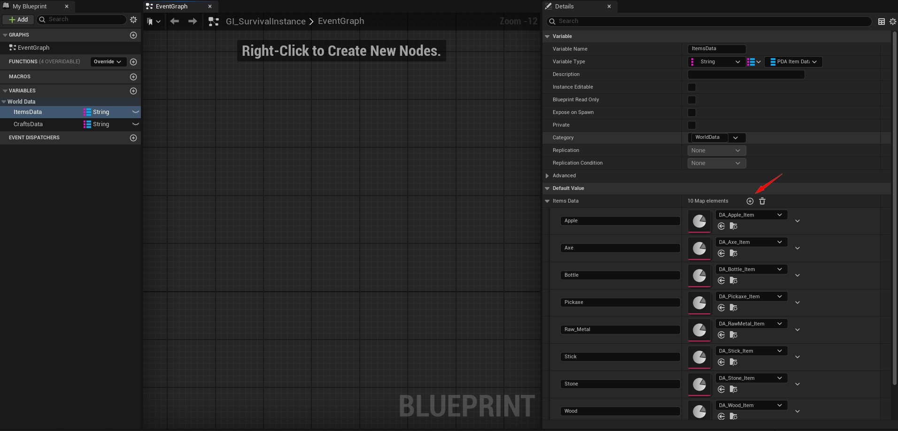

# 🚀 How to create an item ?

### 1. Create a new item data asset

Go to the **Content Browser**, right-click → **Miscellaneous → Data Asset**.

Select `PDA_ItemData` as the class, then name it something like `DA_Wood_Item`.

---

### 2. Fill in the basic item informations

Open the newly created Data Asset and fill in the fields:

| Property               | Description                                                                 |
|------------------------|-----------------------------------------------------------------------------|
| `Item ID`              | Unique identifier (must be unique across all items)                         |
| `Item Name`            | Display name used in UI                                                     |
| `Item Desc`            | Item description, shown in tooltips                                         |
| `Item Icon`            | Texture used in the inventory or crafting UI                                |
| `Item Mesh`            | Static mesh for pickup/world representation                                 |
| `Item Size`            | Size for world scaling                                          |
| `Item Max Stack`       | Maximum number of items per slot            |
| `Item Max Durability`  | Optional durability system for tools, weapons, etc.                         |
| `Item Type`            | Enum value from `E_ItemTypes` (e.g. Consumable, Gear, Tool...)              |
| `Slot Types`           | Defines which inventory slot types can hold the item (e.g. Main, Head, ...) |
| `Item Actions`         | List of usable actions (equip, drop, split, consume, ...)                       |
| `Equippable Type`      | Type of equipment slot (e.g. Wieldable, Head, Chestplate, ...)                |
| `Wieldable Class`      | Actor class spawned when equipped (tool, weapon, etc.) - Client side                   |
| `Cosmetic Static Mesh` | Optional visual mesh when equipped                                          |
| `Cosmetic Skeletal Mesh`| Optional skeletal mesh for animated cosmetics                             |
| `Cosmetic Socket`      | Name of socket/bone to attach the item to                                   |
| `Cosmetic Size`        | Scaling info for cosmetics                                     |
| `Equipment Modifiers`  | Struct of gameplay effects (armor, resistances, etc.)                       |
| `Consume Modifiers`    | Struct of gameplay effects (hunger/thirst/health gain)                      |
| `Pickup Sound`         | Sound played when picking the item up                                       |
| `Equip Sound`          | Sound played when equipping the item                                        |

!!! tip
    You can extend the `E_ItemTypes` enum to add more item categories like `Special`, `Quest`, etc.

---

### 3. Add the item in the game data

Open : `MPSurvival/Blueprints/PlayerCharacter/GI_SurvivalInstance`

Then add the item with his same ID in the map variable called : ItemsData

