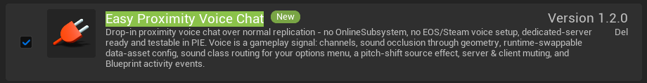
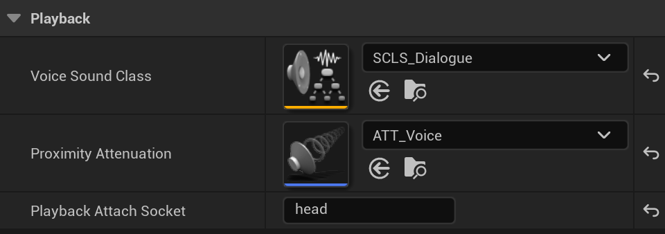
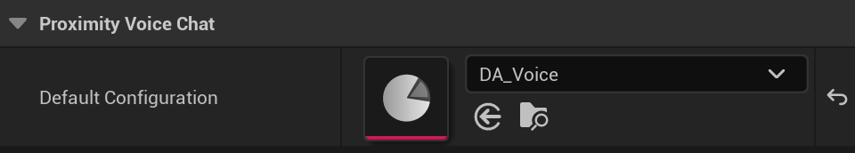
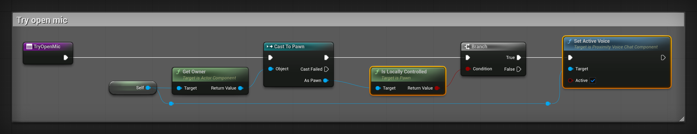
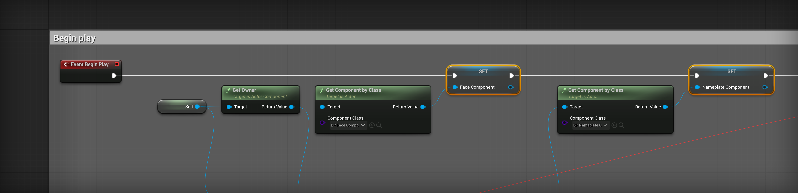
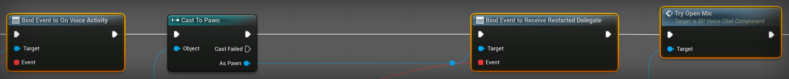
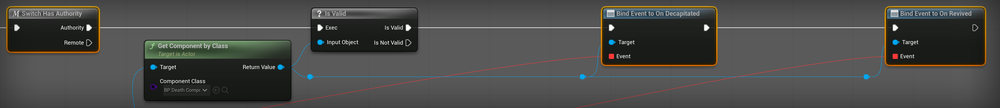
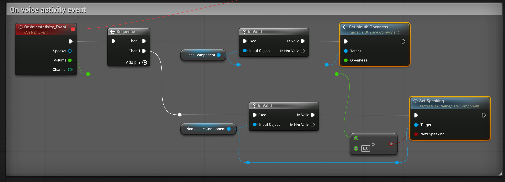
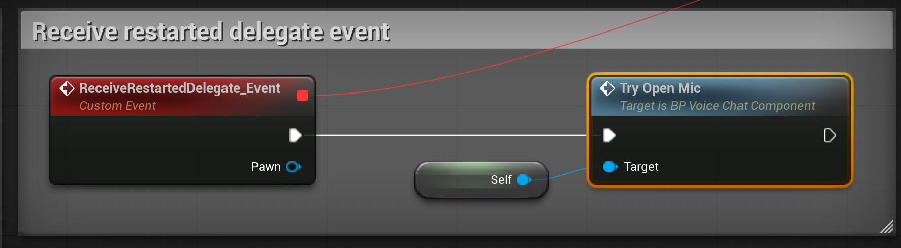
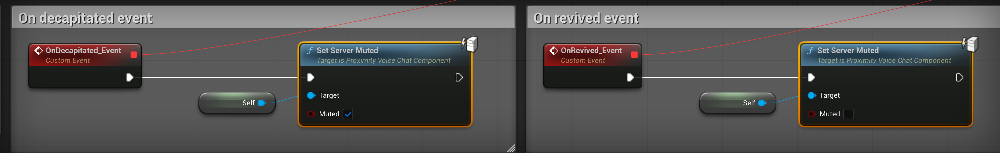

# Add proximity voice chat with Easy Proximity Voice Chat

After this guide, players hear each other by distance, the mouth of the player who talks moves, and a microphone shows above their name. A dead player is muted until a revive bay brings them back.

The guide uses Easy Proximity Voice Chat (EPVC) 1.2, a separate plugin on Fab. MPFriendslopV2 does not include it, but it already has the hooks that EPVC needs: `Set Mouth Openness` on `BP_FaceComponent` and `Set Speaking` on `BP_NameplateComponent`.

## Before you start

- EPVC 1.2 for Unreal Engine 5.8, installed from Fab with **Install to Engine**.
- A microphone.
- MPFriendslopV2 open in Unreal Engine 5.8.

---

## Turn the plugin on

1. Open **Edit**, then **Plugins**.
2. Type `Easy Proximity Voice Chat` in the search box.
3. Tick the box on its line.

    { width="920" }

4. Close the editor. Do not open it again yet.

---

## Turn on voice capture

Unreal does not record the microphone until a setting allows it.

1. Open `Config/DefaultEngine.ini` in a text editor.
2. Add these two lines at the end of the file:

    ```ini
    [Voice]
    bEnabled=true
    ```

3. Save the file, then open MPFriendslopV2 again.

Unreal reads this setting only when the editor starts.

---

## Create the voice settings

EPVC reads its settings from one Data Asset. The Data Asset points to a Sound Attenuation, which decides how far a voice carries.

1. In `Content/MPFriendslop/Audios/Attenuation/`, right click, then **Audio**, then **Sound Attenuation**. Name it `ATT_Voice`.
2. Open `ATT_Voice`. Set `Inner Radius` to `300` and `Falloff Distance` to `2000`.
3. In `Content/MPFriendslop/Blueprints/DataAssets/`, create a folder named `Voice`.
4. In that folder, right click, then **Miscellaneous**, then **Data Asset**.
5. Pick `ProximityVoiceConfig`. Name it `DA_Voice`.
6. Open `DA_Voice` and fill the three fields of the table below.

    { width="480" }

7. Save both assets.

| Field | Value | Why |
|---|---|---|
| `Voice Sound Class` | `SCLS_Dialogue` | It is a child of `SCLS_Master`, so the `MASTER VOLUME` slider moves the voices too |
| `Proximity Attenuation` | `ATT_Voice` | A voice is loud up to 3 m away and silent past 23 m |
| `Playback Attach Socket` | `head` | The voice comes out of the robot's head, not its feet |

Leave the other fields at their defaults. EPVC muffles a voice behind any wall that blocks the `Visibility` channel, and the walls of the template already block it.

---

## Create the voice component

The voice component is a child of the EPVC component. It adds the links to the face, the nameplate and death.

1. In `Content/MPFriendslop/Blueprints/ActorComponents/`, right click, then **Blueprint Class**.
2. Open **All Classes**, search `ProximityVoiceChatComponent`, and pick it.
3. Name it `BP_VoiceChatComponent`, then open it.
4. Click **Class Defaults**. Set `Default Configuration` to `DA_Voice`.

    { width="480" }

5. In **My Blueprint**, add a variable named `FaceComponent`. Set its type to **BP Face Component**, **Object Reference**.
6. Add a second variable named `NameplateComponent`, of type **BP Nameplate Component**, **Object Reference**.

---

## Open the microphone of the local player

Only the player who talks turns their microphone on. EPVC then sends their voice to the other players.

1. In **My Blueprint**, add a function named `TryOpenMic`.
2. Build its graph: **Get Owner**, **Cast To Pawn**, **Is Locally Controlled**, a **Branch**, and **Set Active Voice** with `Active` ticked.

    { width="1904" }

3. Click **Compile**.

---

## Connect it all at Begin Play

Open the **Event Graph** and start from **Event Begin Play**.

1. Get the owner with **Get Owner**. Pass it to **Get Component by Class**, with `Component Class` set to **BP Face Component**.
2. Set `FaceComponent` with the result.
3. Do the same for **BP Nameplate Component** and `NameplateComponent`.

    { width="2137" }

4. Right click in the graph and search `Assign On Voice Activity`. Unreal adds a **Bind Event to On Voice Activity** node and a new custom event wired to it.
5. Connect the bind node after the second **Set**.
6. Cast the owner with **Cast To Pawn**. From **As Pawn**, search `Assign Receive Restarted Delegate`.
7. After that bind node, call **Try Open Mic**.

    { width="1693" }

8. Add **Switch Has Authority** after **Try Open Mic**.
9. From **Authority**, get the **BP Death Component** of the owner, then check it with **Is Valid**.
10. From **Is Valid**, add `Assign On Decapitated`, then `Assign On Revived`. Their `Target` is the death component.

    { width="2114" }

The second call to **Try Open Mic** is for the host. On a listen server, the host's pawn starts before its controller takes it, so it is not locally controlled at Begin Play. **Receive Restarted** fires after that, on the server and on the player's own machine.

---

## Fill the four custom events

The assign nodes created four custom events. Fill them as follows.

1. `OnVoiceActivity_Event` runs on every machine, for the player who talks. Add a **Sequence**.
2. From **Then 0**, check `FaceComponent` with **Is Valid**, then call **Set Mouth Openness** with `Volume`.
3. From **Then 1**, check `NameplateComponent`, then call **Set Speaking**. Its `New Speaking` is `Volume > 0`.

    { width="1625" }

4. `ReceiveRestartedDelegate_Event` calls **Try Open Mic**.

    { width="887" }

5. `OnDecapitated_Event` calls **Set Server Muted** with `Muted` ticked.
6. `OnRevived_Event` calls **Set Server Muted** with `Muted` not ticked.

    { width="1708" }

7. Click **Compile**, then **Save**.

EPVC sends a volume of `0` when a player stops talking, so the mouth closes and the microphone hides without more nodes.

---

## Add the component to the character

1. Open `Content/MPFriendslop/Blueprints/PlayerCharacter/BP_FriendslopCharacter`.
2. In **Components**, click **Add** and pick `BP_VoiceChatComponent`. Keep its name.
3. Click **Compile**, then **Save**.

On your own character, add the same component. It finds the face, the nameplate and the death component by their class, and skips any that your pawn does not have.

---

## Check that it works

1. In the **Play** options, set **Number of Players** to `2` and **Net Mode** to **Play As Listen Server**.
2. Click **Play**.
3. Open the **Output Log**. It shows `Voice capture started (16000 Hz, mono)`.
4. Walk the two robots close together and talk.
5. Look at the window of the player who listens. The other robot's mouth moves, and a microphone shows above its name.
6. Walk away. The voice fades out past 23 m.
7. Let one player die. While they are down, the other player does not hear them. After a revive at the bay, they can talk again.

The two Play windows share one microphone. You hear your own voice through the other window. That is expected: EPVC never plays a voice on the machine that sends it.

---

## Use push-to-talk instead

The steps above keep the microphone open. For a key to hold instead:

1. In `BP_VoiceChatComponent`, remove the call to **Try Open Mic** from Begin Play, and remove `ReceiveRestartedDelegate_Event` with its bind node.
2. In `Content/MPFriendslop/Inputs/Inputs/`, right click, then **Input**, then **Input Action**. Name it `IA_PushToTalk`.
3. Open `IMC_Default`, add a mapping for `IA_PushToTalk`, and press its key.
4. Open `BP_FriendslopPlayerController` and add the **IA_PushToTalk** event.
5. From **Started**, call **Get Controlled Pawn**, then **Get Component by Class** with **BP Voice Chat Component**.
6. Check the result with **Is Valid**, then call **Set Active Voice** with `Active` ticked.
7. Do the same from **Completed**, with `Active` not ticked.

The template keeps every key in the player controller, and the components read no key themselves. See [The controls, and adding an input](../start/controls.md).

---

## If you hear nothing

| What you see | What to check |
|---|---|
| **Easy Proximity Voice Chat** is not in the Plugins window | EPVC is not installed for Unreal Engine 5.8. Install it from Fab with **Install to Engine**. |
| The Output Log has no `Voice capture started` line | `[Voice]` and `bEnabled=true` are not in `Config/DefaultEngine.ini`, or the editor was not restarted after you added them. |
| The capture starts, but the other player hears nothing | Walk closer: past 23 m, `ATT_Voice` makes the voice silent. Also check that the Windows privacy settings allow the microphone. |

For every setting of EPVC, see the [EPVC documentation](../../epvc/index.md).

---

[Join the Discord](https://discord.gg/EqHCtq38jy)
