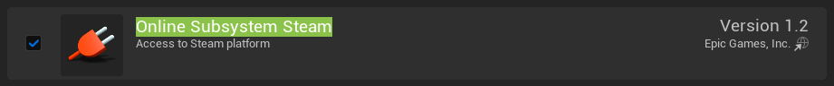
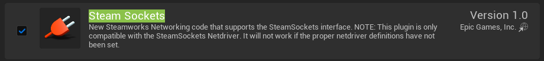
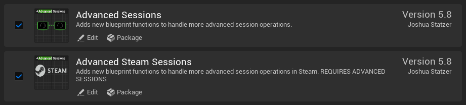
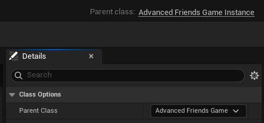
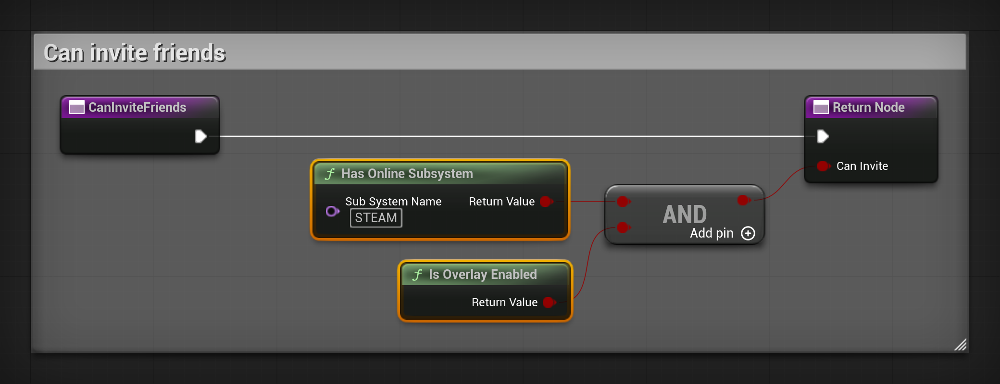
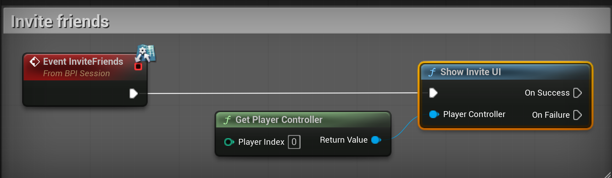
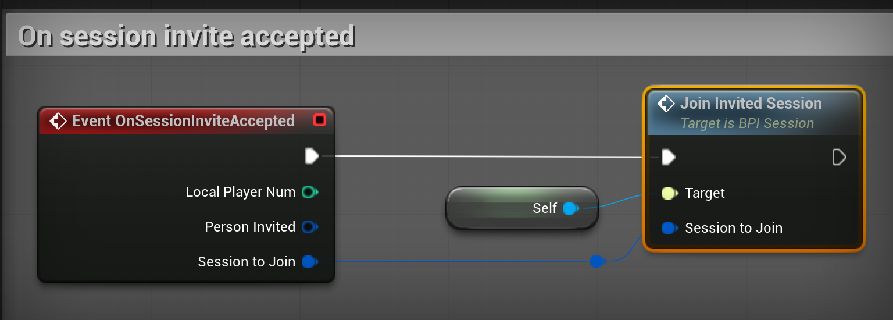

# Set up Steam sessions with Advanced Steam Sessions

After this guide, players host and find sessions through Steam, under their Steam name. The `INVITE FRIENDS` button of the lobby opens the Steam invite window, and a friend who accepts lands in your lobby.

The guide uses Advanced Sessions and Advanced Steam Sessions, two free plugins by Joshua Statzer. MPFriendslopV2 does not include them, but it already has the hooks they need: `Can Invite Friends`, `Invite Friends` and `Join Invited Session` on the `BPI_Session` interface of `BP_FriendslopGameInstance`.

## Before you start

- MPFriendslopV2 in Unreal Engine 5.8.
- The Steam client, installed, running and logged in.
- To test a join: a second PC with a second Steam account.

---

## Download the plugins

1. Open [vreue4.com/advanced-sessions-binaries](https://vreue4.com/advanced-sessions-binaries).
2. Download `AdvancedSessionsPlugin-5.8.2`. It is a zip file on Google Drive.
3. Unzip it. Inside `AdvancedSessionsPlugin`, you find a folder named `AdvancedSessions`.
4. Close the editor.
5. Next to `MPFriendslopV2.uproject`, create a folder named `Plugins`.
6. Copy the `AdvancedSessions` folder into `Plugins`.

Your project now holds these two plugin folders:

```text
MPFriendslopV2/
    MPFriendslopV2.uproject
    Plugins/
        AdvancedSessions/
            AdvancedSessions/
            AdvancedSteamSessions/
```

The `ExampleBlueprints` folder of the zip is not needed. The plugins come already built for Unreal Engine 5.8, so the editor opens without compiling anything.

---

## Turn the plugins on

1. Open MPFriendslopV2.
2. Open **Edit**, then **Plugins**.
3. Type `Online Subsystem Steam` in the search box, and tick its box.

    { width="921" }

4. Type `Steam Sockets` in the search box, and tick its box.

    { width="920" }

5. Clear the search box. In the list on the left, click **Advanced Sessions Plugin**, under **Project**.
6. Tick **Advanced Sessions** and **Advanced Steam Sessions**.

    { width="921" }

7. Close the editor. Do not open it again yet.

Steam Sockets carries the network driver that connects players through Steam. Since Unreal Engine 5.6, Online Subsystem Steam no longer contains one.

---

## Tell Unreal to use Steam

1. Open `Config/DefaultEngine.ini` in a text editor.
2. Add these lines at the end of the file:

    ```ini
    [/Script/Engine.GameEngine]
    !NetDriverDefinitions=ClearArray
    +NetDriverDefinitions=(DefName="GameNetDriver",DriverClassName="/Script/SteamSockets.SteamSocketsNetDriver",DriverClassNameFallback="/Script/OnlineSubsystemUtils.IpNetDriver")
    +NetDriverDefinitions=(DefName="DemoNetDriver",DriverClassName="/Script/Engine.DemoNetDriver",DriverClassNameFallback="/Script/Engine.DemoNetDriver")

    [OnlineSubsystem]
    DefaultPlatformService=Steam

    [OnlineSubsystemSteam]
    bEnabled=true
    SteamDevAppId=480
    bInitServerOnClient=true
    ```

3. Save the file, then open MPFriendslopV2 again.

| Line | Why |
|---|---|
| `!NetDriverDefinitions=ClearArray` | Removes the network driver the engine declares by default. Unreal uses the first one it finds, so without this line it ignores the Steam driver |
| `SteamSocketsNetDriver` | Players connect through Steam, to a Steam ID, with no port to open on the router |
| `IpNetDriver` | The fallback. Steam does not start in Play In Editor, so the editor keeps playing over IP |
| `DefaultPlatformService=Steam` | Sessions go through Steam instead of the default online subsystem |
| `SteamDevAppId=480` | Spacewar, the test app that Valve shares with every developer |
| `bInitServerOnClient=true` | Lets a player host a session. Without it, `HOST RUN` fails |

---

## Change the parent of the game instance

1. Open `Content/MPFriendslop/Blueprints/Misc/BP_FriendslopGameInstance`.
2. Click **Class Settings** in the toolbar.
3. In **Details**, set `Parent Class` to `AdvancedFriendsGameInstance`.

    { width="440" }

4. Click **Compile**.

`AdvancedFriendsGameInstance` is a child of `GameInstance`, so the Blueprint keeps everything it had. It adds the event that runs when a player accepts a Steam invite.

---

## Turn the invite button on

`Can Invite Friends` decides whether the `INVITE FRIENDS` button of the lobby works. In the template it returns false, so the button shows greyed out, with `STEAM NEEDS TO BE SET UP` under its label.

1. In **My Blueprint**, under **Interfaces**, double click `CanInviteFriends`.
2. Add **Has Online Subsystem**, and type `STEAM` in `Sub System Name`.
3. Add **Is Overlay Enabled**.
4. Join both results with an **AND**, and connect it to `Can Invite` on the **Return Node**.

    { width="1040" }

The button turns on by itself when the lobby opens. No widget needs to change.

---

## Open the Steam invite window

1. Open the **Event Graph**. Right click and search `Event Invite Friends`. Pick the one from **BPI Session**.
2. Add **Get Player Controller**, with `Player Index` at `0`.
3. From the event, call **Show Invite UI**. Connect the player controller to its `Player Controller` pin.

    { width="881" }

The `INVITE FRIENDS` button already calls **Invite Friends** through the interface.

---

## Join when a friend accepts

1. Right click in the **Event Graph** and search `Event On Session Invite Accepted`.
2. From the event, call **Join Invited Session**, with **Self** as its `Target`.
3. Connect `Session to Join` of the event to `Session to Join` of the call.

    { width="768" }

4. Click **Compile**, then **Save**.

**Join Invited Session** is part of the template. It leaves the current session if there is one, joins the new one, then opens the lobby. Leave `Auto Join Session on Accepted User Invite Received` unticked in the **Class Defaults**, so the join happens once.

---

## Check that it works

Steam does not start in Play In Editor. There, the game uses the default online subsystem, and `INVITE FRIENDS` stays greyed out.

1. Check that Steam runs and that you are logged in.
2. Open `Content/MPFriendslop/Maps/L_MainMenu`. A standalone game starts on the map open in the editor.
3. Open the menu next to **Play** and pick **Standalone Game**.
4. In the game, press `Shift+Tab`. The Steam overlay opens.
5. Click `HOST RUN`, then `OPEN LOBBY`. The `INVITE FRIENDS` button is on.
6. Click `INVITE FRIENDS`. The Steam window opens on your friends list.
7. On a second PC, log in with another Steam account and launch the game.
8. Open `JOIN`. Your session shows under your Steam name. Click it to join your lobby.
9. Leave the lobby on the second PC. On the first PC, click `INVITE FRIENDS` and invite the second account.
10. On the second PC, keep the game running and accept the invite. The game joins your lobby.

---

## Before you ship your game

- Replace `480` with the App ID that Steam gives your game.
- A Development build writes `steam_appid.txt` next to the game's executable, so it starts without the Steam client launching it. A Shipping build does not. Never ship that file in your Steam depot.
- Steam does not give the ping of a session. The session list hides it: `Unknown Ping` on `WBP_SessionRow` is `9999`, the value Steam sends.

---

## If it does not work

| What you see | What to check |
|---|---|
| `INVITE FRIENDS` stays greyed out in Play In Editor | That is expected: Steam does not start in the editor. Test with **Standalone Game** or a packaged build. |
| `Shift+Tab` does nothing in the game | Steam is not running, or you are not logged in. Also check the lines of `Config/DefaultEngine.ini`. |
| The session shows in `JOIN`, but a click on it brings you back to the menu with `LOST CONNECTION TO THE HOST` | The game used the IP driver, which cannot reach a Steam ID. Check that **Steam Sockets** is ticked and that `DriverClassName` names `/Script/SteamSockets.SteamSocketsNetDriver`. In the log, the line `AddressResolution: Result [Host=steam.` ends with `[FAILED]` |

For every setting of the Steam online subsystem, see [Online Subsystem Steam](https://dev.epicgames.com/documentation/unreal-engine/online-subsystem-steam-interface-in-unreal-engine) in the Unreal Engine documentation.

---

[Join the Discord](https://discord.gg/EqHCtq38jy)
