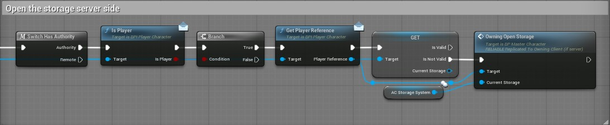

# 🚀 How to create a storage ?

### 1. Add the storage component

In your Blueprint, add the component `AC_StorageSystem`.

---

### 2. Implement the storage interface

- Add the interface `BPI_StorageManager` to your Blueprint.
- Implement the interface function `GetStorageComponent`.
- Return your `AC_StorageSystem` component in the return value.

This works like the vital manager interface.

---

### 3. Open the storage UI

To open the storage, call the function `Owning_OpenStorage` from the server side.

---

!!! tip  
    Make sure your Blueprint is properly set up on the server to allow multiplayer interaction with storage.

---
