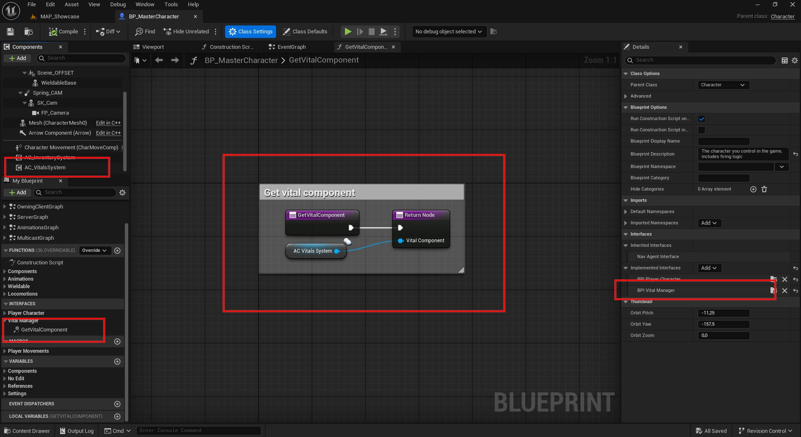

# 🚀 How to create a vital ?

### 1. Create a new vital data asset

Go to the **Content Browser**, right-click → **Miscellaneous → Data Asset**.

Select `BP_VitalData` as the class, then name it something like `DA_Health_Vital`.

---

### 2. Fill in the vital fields

Open the newly created Data Asset and fill in the fields:

| Property               | Description                                             |
|------------------------|---------------------------------------------------------|
| `Vital Name`           | Display name of the vital                                |
| `Vital Icon`           | Icon texture used in UI                                  |
| `Vital Type`           | Enum value from `E_VitalsType` (e.g. Health, Hunger)    |
| `Vital Color`          | Color used for the vital’s progress bar or UI element   |
| `Vital Max Amount`     | Maximum value the vital can reach                        |
| `Vital Tick Decrementation` | Rate at which the vital decreases over time (e.g. hunger, thirst) |

---

### 3. Add vitals to Blueprints

You can add vitals directly to any Blueprint as long as:

- The Blueprint implements the `BPI_VitalManager` interface.
- The interface function `Get Vital Component` is properly implemented to return the vital component reference.

This allows flexible integration of vitals on characters, NPCs, or other actors.

!!! tip  
    You can extend the `E_VitalsType` enum to add more custom vital types if needed.

---
